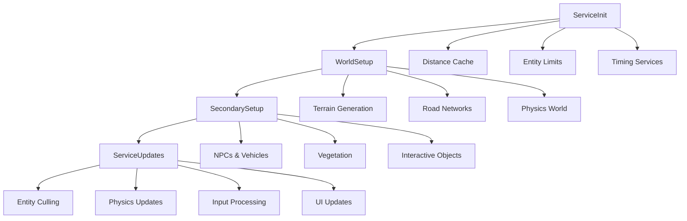
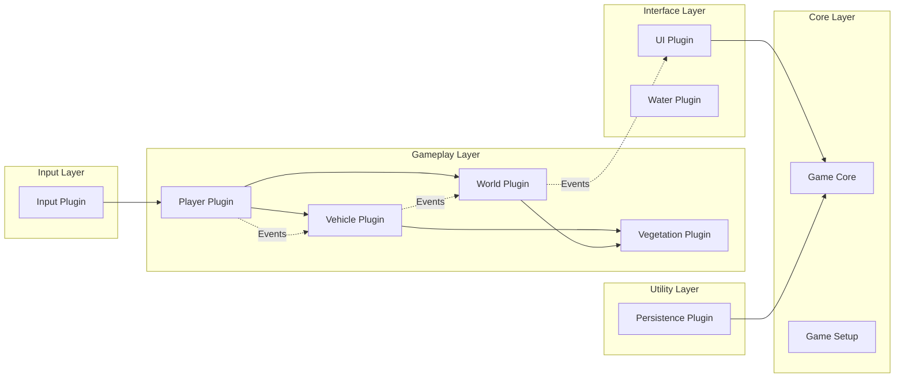
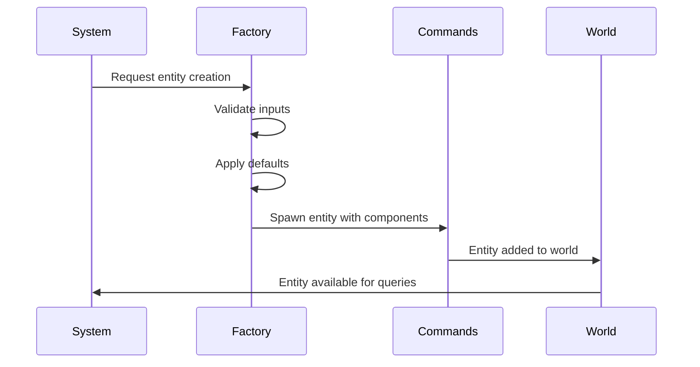
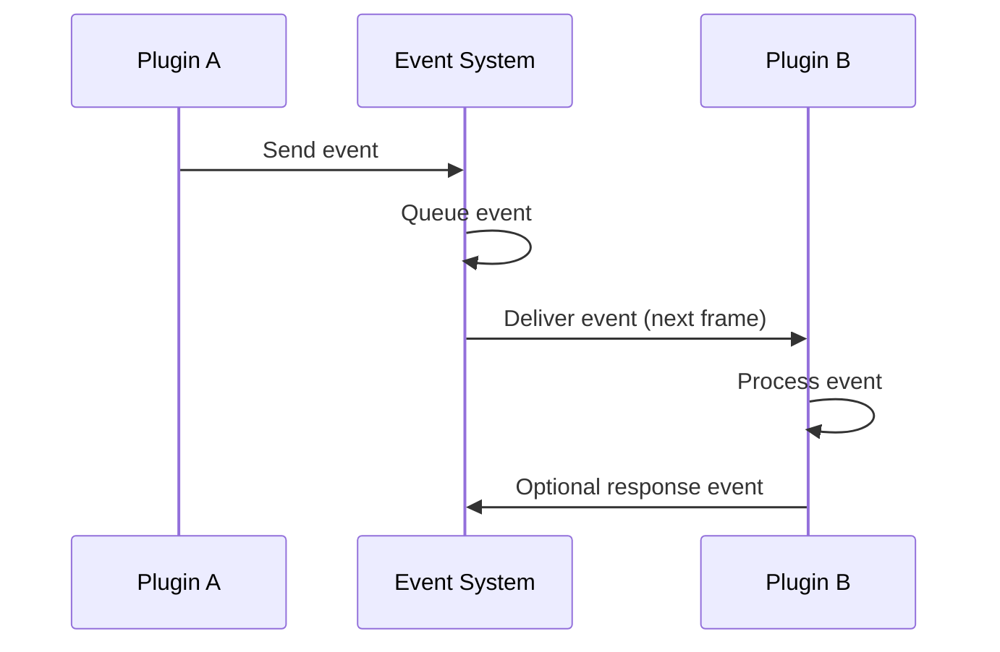

# Architecture Overview

This document provides a high-level overview of the Bevy GTA Clone's architecture and how the different modules work together.

## Core Architecture Principles

### Simplicity First
- Clear separation of concerns between modules
- Minimal coupling between components
- Straightforward data flow that's easy to trace
- No complex inheritance hierarchies

### Bevy ECS Patterns
- **Components**: Pure data structures (no behavior)
- **Systems**: Pure functions that operate on components
- **Resources**: Shared state across systems
- **Events**: Communication between plugins
- **Plugins**: Self-contained modules with clear interfaces

## System Execution Flow



## Plugin Communication Architecture



## Module Responsibilities

### Components (`src/components/`)
- **Purpose**: Pure data structures that store entity state
- **Rules**: No behavior, only data fields
- **Examples**: `PlayerComponent`, `VehicleComponent`, `LodComponent`

### Systems (`src/systems/`)
- **Purpose**: Pure functions that operate on components
- **Rules**: Single responsibility, communicate via events/resources
- **Categories**: Gameplay, World Management, Services, Interface

### Plugins (`src/plugins/`)
- **Purpose**: Self-contained modules that manage specific game features
- **Rules**: Event-based communication only, no direct dependencies
- **Types**: Core, Gameplay, Interface, Utility

### Factories (`src/factories/`)
- **Purpose**: Consistent entity creation patterns
- **Rules**: Stateless functions, input validation, default values
- **Benefits**: Consistency, maintainability, testability

## Data Flow Patterns

### Entity Creation Flow


### Event Communication Flow


## Performance Optimization Strategy

### Distance-Based Culling
- **Buildings**: 300m range
- **Vehicles**: 150m range  
- **NPCs**: 100m range
- **Cache**: 5-frame cache with 2048 entry limit

### System Timing Intervals
- **Road Generation**: 0.5s intervals
- **Dynamic Content**: 2.0s intervals
- **Entity Culling**: 0.5s intervals

### Spawn Rate Limits (Ultra-Reduced)
- **Buildings**: 8% spawn rate
- **Vehicles**: 4% spawn rate
- **Trees**: 5% spawn rate
- **NPCs**: 1% spawn rate

## Development Guidelines

### Adding New Features
1. **Identify the domain**: Which plugin should own this feature?
2. **Design components**: What data structures are needed?
3. **Create systems**: What functions operate on this data?
4. **Define events**: How does this communicate with other plugins?
5. **Use system sets**: Which execution phase does this belong to?

### Maintaining Simplicity
- Avoid tangled interdependencies between modules
- Keep functions focused on single responsibilities
- Use clear, direct APIs between components
- Prefer composition over complex inheritance
- Make data flow easy to trace

### Testing Strategy
- **Unit Tests**: Test individual systems and components
- **Integration Tests**: Test plugin interactions
- **Performance Tests**: Verify frame rate targets
- **Pattern**: Use `App::new().add_plugins(MinimalPlugins)` for Bevy tests

## Common Patterns

### System Registration
```rust
app.add_systems(Update, (
    my_system.in_set(GameSystemSets::ServiceUpdates),
    another_system.in_set(GameSystemSets::WorldSetup),
));
```

### Event Communication
```rust
// Sending events
fn sender_system(mut events: EventWriter<MyEvent>) {
    events.send(MyEvent { data: "hello" });
}

// Receiving events  
fn receiver_system(mut events: EventReader<MyEvent>) {
    for event in events.read() {
        // Process event
    }
}
```

### Resource Access
```rust
fn system_with_resources(
    mut shared_resource: ResMut<MyResource>,
    read_only_resource: Res<AnotherResource>,
) {
    // Access shared state
}
```

This architecture enables scalable development while maintaining the core principle of simplicity throughout the codebase.
